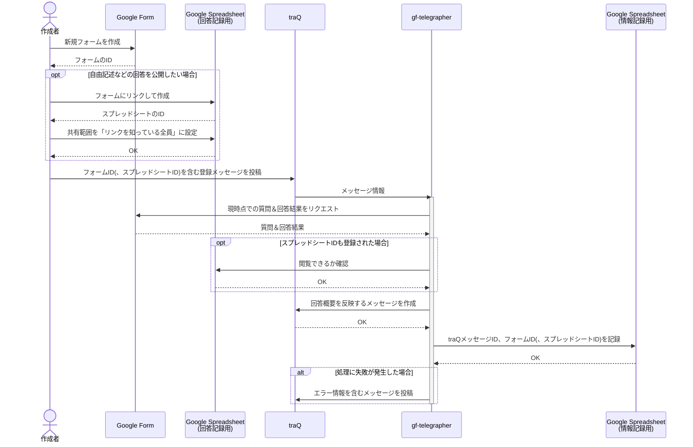
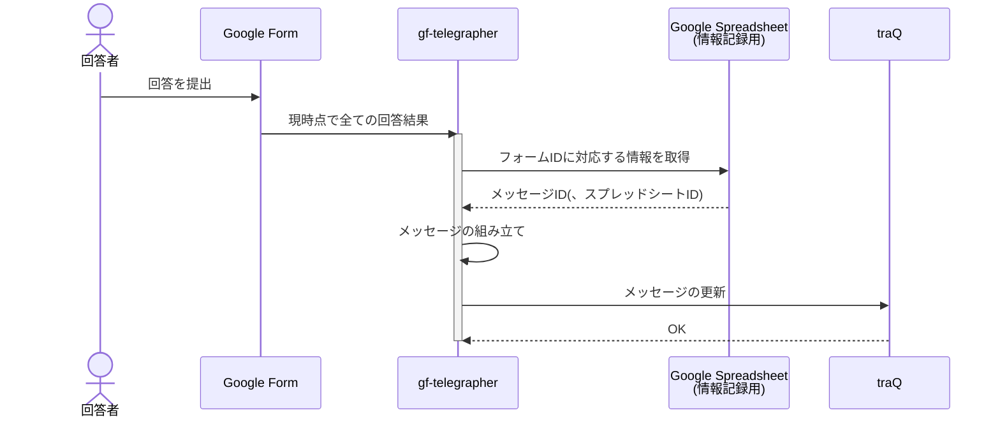

# Design

[toc]

## 使い方

- gf-telegrapherは実行可能APIとして公開する
- ユーザーは作成したGoogle Formに対し、GASを作成して適用する
    - 用意されたコードをコピペして適切な設定をすればOK
    - 新規回答が提出された時にgf-telegrapherのAPIに対して情報を送りつけるようなAPIコールをする
        - gf-telegrapherのAccess Token
            - Access Tokenの記述を含めた最終的なソースコードは閲覧範囲が限られた環境でのみ公開
        - FormのID
        - 現時点でのFormの全ての回答結果
- ユーザーはtraQ上でgf-telegrapherのBOTに対する指定の書式のメンションメッセージででアンケート情報の登録を実行
    - 記載する情報
        - FormのID
        - (回答を記録しているSpread SheetのID)
    - gf-telegrapherはFromとSpread Sheet、概要情報を反映するtraQメッセージのIDの組を記録
    - gf-telegrapherは、Spread Sheetへのアクセス権限などが不十分である場合はエラー情報を返す

traQメッセージに反映する質問の条件
- 所定のprefixが付与された質問
- 回答形式が選択式(ラジオボタン、チェックボックス)
- 「traP ID」についての質問を含んでいる必要がある
    - 任意回答の場合、「unknownによる回答」として扱う

## 実行の流れ

### 新規フォーム登録時

### フォームへの回答提出時

## 名前の由来

GF(Google Form)の回答概要を即時に伝達するtelegrapher(電信技師; 電報における電文を打電する人)

